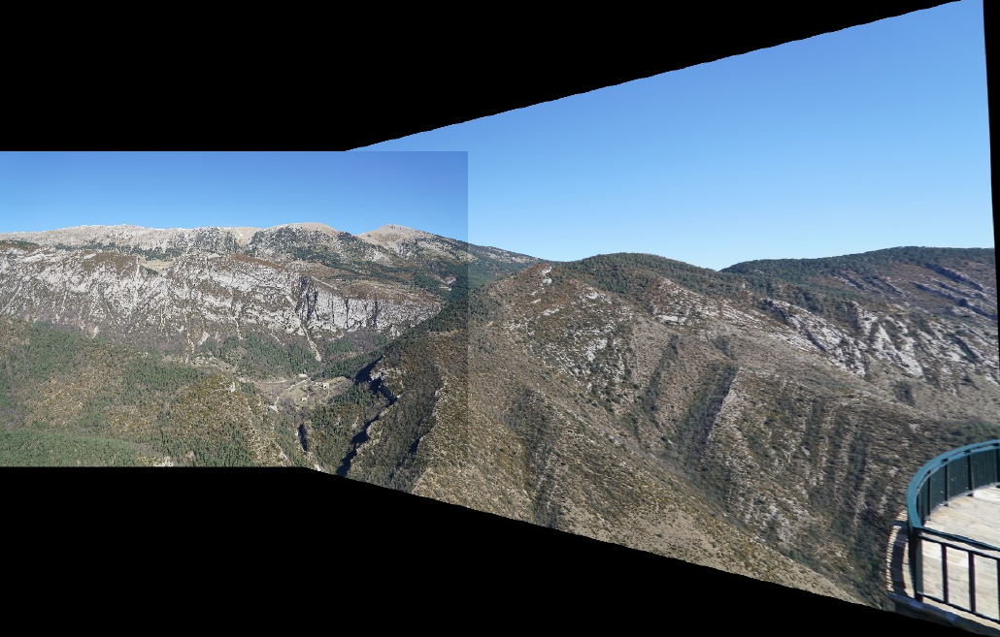
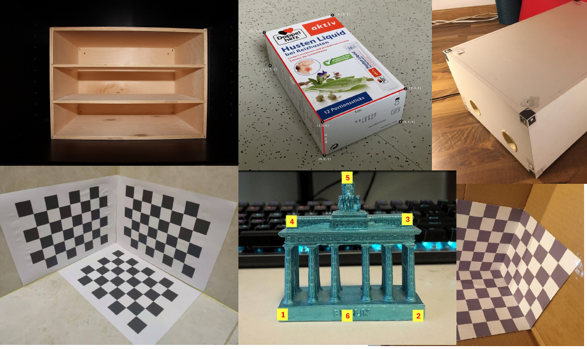

## Introduction:

This repo includes 5 pratical tasks I did for PCV in the 2020 Winter semester.

### Exercise 2 Projective Transformation:

In this exercise a fundamental projective transformation should be realized. The task consists of rectifying images geometrically and stitching them together.

1. Image acquistion
2. Correspondance analysis
3. 2D Homography Computation
4. Projective Rectification

### Exercise 3: Camera calibration using a direct linear transformation

1. Image acquistion
2. control point measurements (6 points)
3. computation of the projection matrix
4. Intrpretation of the projection matrix (RQ decomposition)

Theory:

Euclidian Transformation: 3DOF in 2D, 6 DOF in 3D(rotation + translation) =>External orientation

Similarity Transformation: 4DOF in 2D, 7 DOF in 3D

Affine Transformation: 6DOF in 2d, 12 DOF in 3D.

Projective Transformation: 8DOF in 2d, 15 DOF in 3D.

### Exercise 4: Estimation of fundamental Matrix

##### part 1: using manually clicked point paris

1. Image acquisition
2. Homologous points (8 pairs)
3. Computation of the F matrix
4. Enforce Singularity
5. Deconditioning

##### **part 2: using automatically determined point pairs**

1. Key point detection
2. Key point description
3. Key point matching
4. Filtering ratio test; cross consistency check
5. Robust estimation

#### Exervise 5: SFM Pose Estimation

state representation: internal / external calibration, tracks

1. Acquire essential matrix from fundamental matrix
2. SVD on R to acquire t & R
3. global error estimation
